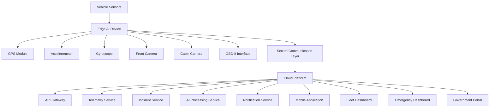
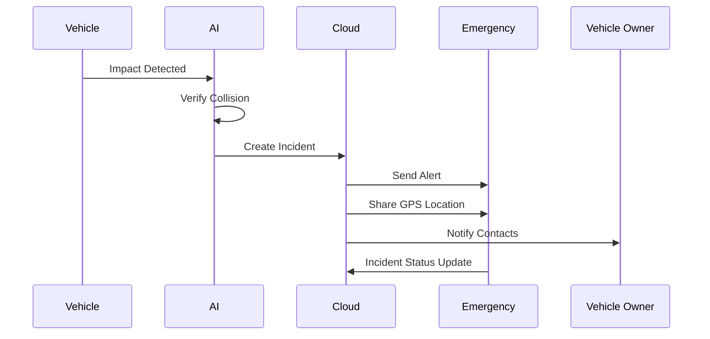

# Intelligent Vehicle Safety & Emergency Response System


---

## Project Overview

Road accidents continue to be one of the leading causes of injuries and fatalities worldwide. In many situations, emergency response is delayed, accident evidence is lost, and dangerous driving behavior goes undetected until it is too late.

The Intelligent Vehicle Safety & Emergency Response Platform was created to address these challenges through a combination of vehicle telemetry, artificial intelligence, edge computing, and cloud-based monitoring.

The platform continuously monitors vehicle movement, driver behavior, accident events, and emergency situations. When a critical event occurs, the system automatically analyzes the situation, records evidence, notifies emergency contacts, and provides real-time information to authorized personnel.

The long-term goal is to build a connected road safety ecosystem capable of supporting fleets, emergency services, insurance providers, and future smart-city infrastructure.

---

## Architecture Overview



---

## What Problem Does This Solve?

### Driver Safety

* Driver fatigue detection
* Driver drowsiness monitoring
* Driver distraction detection
* Unsafe driving alerts
* Driver behavior scoring

### Accident Detection

* Real-time collision identification
* Crash severity estimation
* Automatic incident creation
* Evidence preservation
* Vehicle telemetry analysis

### Emergency Response

* SOS activation
* Automatic emergency alerts
* GPS location sharing
* Emergency contact notification
* Incident management

### Fleet Management

* Live vehicle tracking
* Fleet monitoring
* Route analysis
* Driver performance monitoring
* Vehicle health insights

---

## Hardware Components

The platform is designed to work with dedicated vehicle hardware.

### Core Sensors

| Component         | Purpose                       |
| ----------------- | ----------------------------- |
| GPS Module        | Real-time location tracking   |
| Accelerometer     | Impact detection              |
| Gyroscope         | Roll-over and motion analysis |
| Front Camera      | Road monitoring               |
| Cabin Camera      | Driver monitoring             |
| OBD-II Interface  | Vehicle diagnostics           |
| CAN Bus Interface | Vehicle telemetry             |
| SOS Button        | Emergency activation          |

### Communication Components

| Component        | Purpose               |
| ---------------- | --------------------- |
| 4G / 5G Module   | Cloud connectivity    |
| Wi-Fi Module     | Local synchronization |
| Bluetooth Module | Mobile integration    |

### Edge Computing

| Component             | Purpose             |
| --------------------- | ------------------- |
| Raspberry Pi / Jetson | Local AI processing |
| AI Accelerator        | Real-time inference |

---

## Software Components

### Backend Services

```text
backend/

├── Authentication Service
├── User Service
├── Vehicle Service
├── Telemetry Service
├── Incident Service
├── Notification Service
├── AI Service
├── Device Management Service
├── Audit Service
└── Reporting Service
```

### Frontend Applications

```text
frontend/

├── User Mobile Application
├── Fleet Dashboard
├── Emergency Dashboard
├── Government Portal
└── Administrator Console
```

---

## AI Modules

### Driver Monitoring Engine

The Driver Monitoring Engine continuously evaluates driver attention and behavior.

Capabilities:

* Eye closure detection
* Head pose estimation
* Fatigue analysis
* Distraction detection
* Driver risk scoring

### Accident Detection Engine

The Accident Detection Engine combines multiple sensor inputs to verify accident events.

Inputs:

* Accelerometer data
* Gyroscope data
* GPS telemetry
* Vehicle diagnostics
* Camera feeds

Outputs:

* Collision confidence score
* Severity level
* Incident classification
* Emergency trigger recommendation

---

## Emergency Workflow



---

## Technology Stack

### Backend

* Python
* FastAPI
* PostgreSQL
* Redis
* Celery
* WebSocket

### Frontend

* Next.js
* React
* TypeScript
* Tailwind CSS

### Mobile

* Flutter

### AI & Computer Vision

* TensorFlow
* PyTorch
* OpenCV

### Infrastructure

* Docker
* Kubernetes
* NGINX
* Prometheus
* Grafana

---

## Project Structure

```text
vehicle-safety-platform/

├── backend/
├── frontend/
├── mobile/
├── ai/
├── hardware_sim/
├── infrastructure/
├── deployment/
├── docs/
├── scripts/
├── tests/
├── docker/
├── README.md
└── LICENSE
```

---

## Security Principles

The platform follows a security-first approach.

Implemented Controls:

* End-to-end encryption
* Role-based access control
* Multi-factor authentication
* Device identity verification
* Secure communication channels
* Audit logging
* Threat monitoring

Government or emergency access is restricted through authorization workflows and full audit tracking.

---

## Development Roadmap

### Phase 1

* Research & Planning
* Hardware Evaluation
* System Architecture

### Phase 2

* Backend Development
* Hardware Simulation
* Mobile Application

### Phase 3

* AI Integration
* Dashboard Development
* Pilot Testing

### Phase 4

* Production Deployment
* Fleet Integration
* Emergency Services Integration

### Phase 5

* Smart City Integration
* Insurance Partnerships
* International Expansion

---

## Future Vision

The long-term vision is to create a connected transportation safety ecosystem where vehicles, emergency responders, infrastructure, and intelligent systems work together to reduce accidents, improve response times, and save lives.

---

## License

This project is currently under active development.

All rights reserved.
